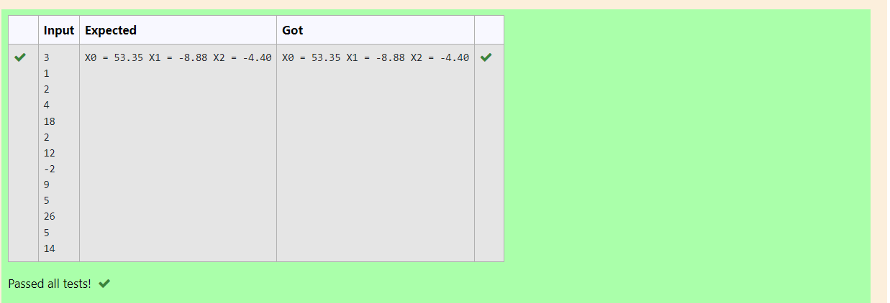

# Gaussian Elimination

## AIM:
To write a program to find the solution of a matrix using Gaussian Elimination.

## Equipments Required:
1. Hardware – PCs
2. Anaconda – Python 3.7 Installation / Moodle-Code Runner

## Algorithm
1. import numpy.
2. import sys.
3. solve using for loop.
4. print the output.

## Program:
```
'''Program to solve a matrix using Gaussian elimination with partial pivoting.
Developed by: S.M.Syed Mokthiyar
RegisterNumber: 22006227
'''
import numpy as np
import sys
#reading number of unknowns
n= int(input())
#Making numpy array of n x n+1 size and initializing
#To zero for storing augmented materix
a=np.zeros((n,n+1))
#Making numpy array of n size and initializing
#To zero for storing solution vector
x=np.zeros(n)
#Reading augmented matrix coefficients
for i in range(n):
    for j in range(n+1):
        a[i][j] = float(input())
#applying Gauss Elimination 
for i in range(n):
    for j in range(i+1, n):
        ratio = a[j][i]/a[i][i]
        for k in range(n+1):
            a[j][k] = a[j][k] - ratio *a[i][k]
#Back s=Substition
x[n-1] = a[n-1][n]/a[n-1][n-1]
for i in range(n-2,-1,-1):
    x[i] = a[i][n]
    for j in range(i+1,n):
          x[i] = x[i] -a[i][j]*x[j]
    x[i] = x[i]/a[i][i]
#Displaying Solution
for  i in range(n):
     print('X%d = %0.2f'%(i,x[i]), end = ' ')
```

## Output:



## Result:
Thus the program to find the solution of a matrix using Gaussian Elimination is written and verified using python programming.

